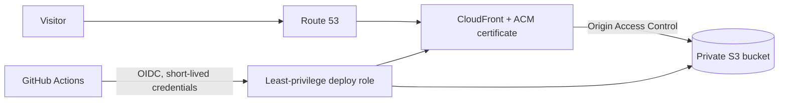
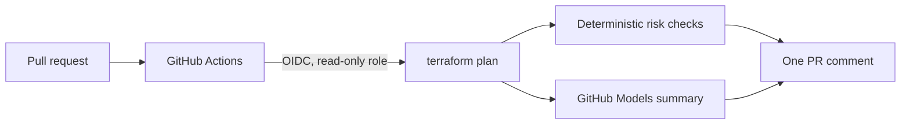

# DevOps Portfolio Site

A personal portfolio site at **https://aiancooldevops.com**, built as a small but production-style
AWS project: everything is defined in Terraform, deployed by a CI/CD pipeline, and every
infrastructure change is reviewed by an AI agent before it can be merged.

## Architecture



## AI plan-review agent

On every pull request that touches `terraform/`, a workflow runs `terraform plan` with a
**read-only** AWS role and posts one comment (updated on each push) with:

1. **Change table**: what will be added, changed, destroyed or replaced.
2. **Risk flags from deterministic checks**: destroys and replacements, changes to IAM,
   security groups and bucket policies, anything open to `0.0.0.0/0`. These are plain code
   running on the plan JSON, so they do not depend on a model being right.
3. **AI summary** from GitHub Models: the plan explained in plain language, with things to double-check.



**Guardrails**

- The agent only comments. It cannot apply changes, and its AWS role has no write access.
- Risk detection is deterministic; the AI only explains. If the model call fails or is rate-limited,
  the comment is still posted with the deterministic part.
- The plan is treated as untrusted data in the prompt (prompt-injection aware).
- Account IDs are masked before the plan is sent to the model and before anything is posted.
- No stored secrets: the model is called with the workflow's built-in `GITHUB_TOKEN` (`models: read`).
- Long plans are truncated, because free-tier models accept only small requests.

<!-- Add a screenshot of a real agent comment here: docs/agent-comment.png -->

## Design decisions

| Decision | Why |
|---|---|
| Private S3 bucket + CloudFront Origin Access Control | The bucket is never public; only this distribution can read it. |
| HTTPS with ACM, HTTP redirected to HTTPS, TLS 1.2+ | Encrypted in transit, certificate renewed automatically. |
| AWS managed security-headers policy | HSTS, X-Content-Type-Options, frame protection out of the box. |
| GitHub OIDC instead of access keys | No long-lived secrets to leak or rotate. |
| Two separate IAM roles: deploy (main branch, write to one bucket) and plan (pull requests, read-only) | Untrusted PR code can never assume a role that changes anything. |
| Plan runs with `-lock=false` | The read-only job does not need to write a lock file to the state bucket. |
| Terraform state in S3 with native locking, encryption on | Reproducible, shared state; no accidental concurrent applies. |
| AI explains, deterministic code flags | LLM output is advisory; safety checks must not depend on model accuracy. |
| CI runs `fmt` and `validate` on every pull request | Broken infrastructure code is caught before merge. |

## Repository layout

```
terraform/             Infrastructure as code
site/                  Static website files
.github/workflows/     terraform-checks, plan-review (agent), deploy-site
.github/scripts/       plan_review.py: the plan-review agent (Python, standard library only)
```

## How to deploy it yourself

Prerequisites: an AWS account, AWS CLI configured, Terraform >= 1.10, a domain with a Route 53 hosted zone.

```bash
# 1. State bucket (one-time)
ACCOUNT_ID=$(aws sts get-caller-identity --query Account --output text)
aws s3api create-bucket --bucket "tfstate-$ACCOUNT_ID" --region us-east-1
aws s3api put-bucket-versioning --bucket "tfstate-$ACCOUNT_ID" \
  --versioning-configuration Status=Enabled
aws s3api put-public-access-block --bucket "tfstate-$ACCOUNT_ID" \
  --public-access-block-configuration BlockPublicAcls=true,IgnorePublicAcls=true,BlockPublicPolicy=true,RestrictPublicBuckets=true

# 2. Configure and apply
cd terraform
cp terraform.tfvars.example terraform.tfvars   # set github_repo to owner/repo (exactly as on GitHub)
terraform init -backend-config="bucket=tfstate-$ACCOUNT_ID"
terraform plan
terraform apply
```

3. Add these as GitHub repository **variables** (Settings > Secrets and variables > Actions > Variables):
   `AWS_ROLE_ARN`, `SITE_BUCKET`, `CLOUDFRONT_DISTRIBUTION_ID`, `AWS_PLAN_ROLE_ARN`
   (all are Terraform outputs). If your account already had the GitHub OIDC provider and you set
   `create_github_oidc_provider = false`, also add `CREATE_GITHUB_OIDC_PROVIDER` = `false`.
4. Run the **deploy-site** workflow (or push a change under `site/`).

To remove everything: empty the site bucket, then run `terraform destroy`.

## Testing the agent

Open pull requests from a branch and close them without merging:

1. **Harmless change**: set `price_class = "PriceClass_All"` in `main.tf`. The agent should report one
   update and explain it.
2. **Risky change**: add a security group open to `0.0.0.0/0` on port 22. The agent must raise a
   risk flag for the open ingress and for a security-sensitive resource.

```hcl
resource "aws_security_group" "agent_test" {
  name        = "agent-test"
  description = "Temporary test, never merge"

  ingress {
    from_port   = 22
    to_port     = 22
    protocol    = "tcp"
    cidr_blocks = ["0.0.0.0/0"]
  }
}
```

## Limits and security notes

- GitHub Models has rate limits and small request-size limits on the free tier; long plans are truncated.
  If the model name is retired, set the `MODEL` environment variable in the workflow to another model.
- Plan text is sent to the model provider. Do not put secrets in Terraform values; Terraform already masks
  values marked `sensitive`.
- The plan role uses the AWS-managed `ReadOnlyAccess` policy. Next step: narrow it to the services used here.
- Forked pull requests do not receive OIDC tokens, so the agent runs only for branches in this repository.

## Cost

Roughly one dollar per month: the Route 53 hosted zone is the main cost; S3, CloudFront and ACM
usage for a small site is negligible or free-tier. The agent adds no AWS cost.

## What I learned / next steps

- _Write here: the problems you hit (DNS propagation, certificate validation, OIDC trust conditions,
  plan role permissions) and how you solved them._
- Next: `tflint` and `checkov` in CI, a monitoring alarm, and narrowing the plan role's permissions.
